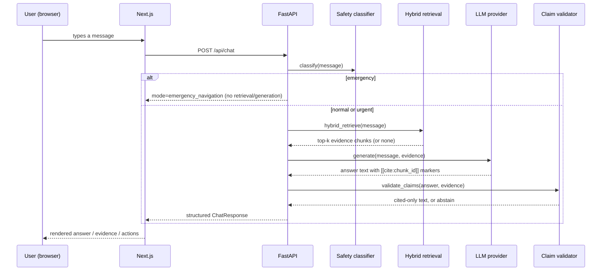

# Architecture

## Repository layout

```
/apps/web            Next.js 14 (App Router) + TypeScript + Tailwind
/services/api        FastAPI + SQLAlchemy + Alembic
/infra               docker-compose.yml
/evals               eval dataset + runner
```

`packages/shared` and a separate `/tests/e2e` at the repo root (from the
original plan) were folded into `apps/web/tests/e2e` -- one fewer top-level
directory for the same content, since Playwright specs only ever exercise the
web app.

## Request flow (chat)



## Backend module map (`services/api/app`)

- `main.py` -- FastAPI app, CORS, request-id logging middleware, router wiring.
- `config.py` / `db.py` / `db_types.py` -- settings, SQLAlchemy engine, and the
  dialect-aware embedding column type (Postgres+pgvector in production,
  JSON-array fallback on SQLite for tests).
- `models.py` -- all SQLAlchemy tables in one file (16 tables; small enough
  that splitting into a package would be pure ceremony).
- `security.py` / `deps.py` -- password hashing (bcrypt directly), JWT
  issuance/verification, FastAPI auth dependencies.
- `providers/` -- pluggable external-service interfaces: `embeddings.py`,
  `llm.py`, `ocr.py`, `directory.py` (maps/provider search), `storage.py`
  (uploaded-file persistence), each with a mock/local implementation and,
  where relevant, a real one behind the same interface.
- `uploads.py` / `rate_limit.py` -- shared upload MIME/size validation and a
  simple in-memory per-IP rate limiter, both used across multiple routers.
- `rag/` -- `chunking.py`, `ingest.py`, `retrieval.py`, `claims.py`: the RAG
  pipeline. See [RAG_ARCHITECTURE.md](RAG_ARCHITECTURE.md).
- `safety/` -- `classifier.py`, `emergency.py`: the independent safety layer.
  See [SAFETY.md](SAFETY.md).
- `routers/` -- one file per API surface (`chat`, `medicine`, `prescription`,
  `providers`, `emergency`, `feedback`, `auth`, `admin`, `health`).

## Frontend module map (`apps/web`)

- `app/` -- one route per screen (App Router), each a client component that
  calls the API directly via `lib/api.ts`.
- `components/ui/` -- the design system primitives (Button/LinkButton, Card,
  Alert, Badge, Input/Textarea, Skeleton, EmptyState). Deliberately small.
- `components/` -- feature components: `ChatMessage`, `EmergencyBanner`,
  `EvidencePanel` (native `<details>`, no dialog/collapsible library), `NavBar`,
  `LanguageSelector`.
- `lib/i18n/` -- hand-rolled dictionary-based i18n (`en`/`hi`/`gu`) + React
  context; no i18n framework (see [DECISIONS.md](DECISIONS.md)).
- `lib/api.ts` -- typed fetch wrapper; `lib/session.ts` -- anonymous
  per-browser session id for guest chat history grouping.

## Data model

16 tables: `users`, `auth_sessions`, `conversations`, `messages`,
`rag_sources`, `rag_documents`, `rag_chunks`, `retrieval_logs`,
`evidence_references`, `safety_events`, `medicines`, `uploaded_documents`,
`providers`, `audit_events`, `feedback`, `application_settings`.

Two merges from the original spec's entity list, both documented in
[DECISIONS.md](DECISIONS.md): `MedicineAlias` folded into
`Medicine.aliases` (array column), and `ProviderLocation` folded into
`Provider` (one row per location).

## Why this shape

- **One Postgres, not Postgres+Qdrant.** pgvector gives a real vector column
  type with a migration path to ANN indexing, without running a second
  stateful service for an MVP-scale demo corpus.
- **Provider interfaces everywhere external.** LLM, OCR, and maps are the
  three things this app cannot control or guarantee at build time (cost,
  availability, credentials). Isolating them behind small interfaces means the
  mock-by-default decision cost nothing in code shape, and swapping in a real
  provider is a config change, not a rewrite.
- **Citation markers are structural, not a prompt request.** The mock
  provider and all four real ones (Anthropic, Gemini, Groq, Ollama) emit the
  same `[[cite:chunk_id]]` marker format, and a single `claims.py` validator
  enforces it against the actually retrieved chunk set on every response,
  regardless of provider -- including a locally-run offline model. When
  `LLM_PROVIDER=gemini`, Gemini/Groq/Ollama form an ordered fallback chain
  (`CascadingLLMProvider`) rather than independent choices -- see
  [RAG_ARCHITECTURE.md](RAG_ARCHITECTURE.md) and
  [DECISIONS.md](DECISIONS.md).
